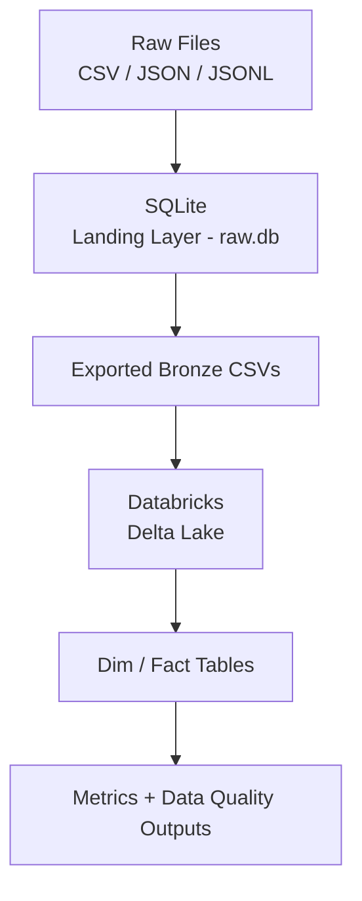

# Data Engineering Assessment

## Overview

This project implements an end-to-end data pipeline for ingesting, transforming, and analyzing hiring workflow data.

The solution is divided into three layers:

1. **Ingestion (Local Python + SQLite)**
2. **Transformation (PySpark + Delta Lake on Databricks)**
3. **Data Quality & Metrics Layer**

---

## Architecture


---

## Design Decisions

### 1. Layering Strategy

- **Landing Layer (SQLite - `raw.db`)**
  - Stores ingested data with minimal transformation
  - Ensures idempotent ingestion

- **Bronze Layer (Logical)**
  - Represented via cleaned tables in SQLite and Delta
  - Data normalized and standardized

- **Silver/Gold (Databricks Delta)**
  - Dimensional modeling
  - Metrics and aggregations

---

### 2. Technology Choices

| Component | Technology | Reason |
|----------|----------|--------|
| Ingestion | Python + SQLite | Lightweight, easy to run locally |
| Transformation | PySpark (Databricks) | Scalable distributed processing |
| Storage | Delta Lake | ACID, schema enforcement |
| Config | YAML | Decouples logic from environment |

---

## Project Structure
src/
ingest.py
export_bronze.py
config.py
01_load_bronze
02_dim_job
03_dim_candidate
04_fct_workflow_events
05_fct_applications
06_time_to_hire_metrics
07_data_quality_checks

config/
config_local.yaml
config_databricks.yaml

---

## Task 1: Data Ingestion

- Data is ingested from:
  - CSV (jobs, education, applications)
  - JSON (candidates)
  - JSONL (workflow events)

- Stored in SQLite (`raw.db`)

### Key Features

- Idempotent ingestion using:
  - `INSERT OR REPLACE`
  - Primary keys

- Data normalization:
  - Date standardization
  - String trimming
  - JSON serialization (skills)

- Write SQL queries to answer: 
    - a. How many jobs are currently open? 

        **Query**:
        ```sql
        sqlite> SELECT COUNT(*) FROM bronze_jobs WHERE status = 'Open';
        ```

        ***Result*** ->
        | COUNT(*) |
        |----------|
        | 178      |

    - b. Top 5 departments by number of applications. 
        **Query**:
        ```sql
        SELECT j.department as department FROM bronze_jobs j JOIN bronze_applications a ON j.job_id = a.job_id           
        GROUP BY j.department
        ORDER BY 1 DESC
        LIMIT 5; 
        ```
        
        ***Result*** ->
        | department |
        |------------|
        | Sales      |
        | Product    |
        | Marketing  |
        | HR         |
        | Finance    |

    - c. List candidates who applied to more than 3 jobs. 
        **Query**:
        ```sql
        SELECT 
            c.candidate_id,
            c.first_name,
            c.last_name,
            COUNT(a.application_id) AS total_count
        FROM bronze_candidates c
        JOIN bronze_applications a
            ON c.candidate_id = a.candidate_id
        GROUP BY c.candidate_id, c.first_name, c.last_name
        HAVING COUNT(a.application_id) > 3; 
        ```

        ***Result*** ->
        | candidate_id                           | first_name | last_name  | total_count |
        |----------------------------------------|------------|------------|-------------|
        | 0002572a-1130-48f5-9d5d-8f6533611134   | Brian      | Hines      | 4           |
        | 017cc74e-6f18-4343-bf41-5c985a8e8f05   | Sara       | Lee        | 4           |
        | 01e7cde7-33a2-4a5f-8683-4cc5757e2b43   | Mary       | Lambert    | 4           |
        | 01f268f5-6553-45aa-bdbc-34f8c8ddd9bb   | Cindy      | Mcintosh   | 5           |
        | 0240f59a-a638-4854-bb2b-8b80c08bd674   | Gregory    | Armstrong  | 7           |
        | 02b622e9-808e-48d2-9d26-4b1b6593b659   | Joseph     | Guerra     | 4           |
        | ...                                    | ...        | ...        | ...         |
        | feeef3e1-f771-4700-b305-cd23cfd0b040   | George     | Sullivan   | 6           |
        | ffb88ef4-80dc-4873-9eb3-18ad9c15b25e   | Matthew    | Patterson  | 7           |

---

## Task 2: Data Modeling (PySpark)

### Dimensional Model

#### Dimension Tables
- `dim_job`
- `dim_candidate`

#### Fact Tables
- `fct_workflow_events`
- `fct_applications`

---

### Key Transformations

#### 1. Current Status Derivation
- Derived using latest `event_timestamp`

#### 2. Hired Date
- First occurrence of `"Hired"` status

#### 3. Event Processing
- Ensures correct mapping of timestamp → status

---

### Time-to-Hire Metric
Calculate "Time to Hire" (days from Apply to Hired) per job and department. 
> time_to_hire_days = hired_date - apply_date

**Query**
`agg_job = final_df.groupBy('job_id').agg(F.avg('time_to_hire_days').alias('avg_time_to_hire_days'))`

| job_id      | avg_time_to_hire_days |
| ----------- | --------------------- |
| 2e9522d6... | 34.33                 |
| 2067bdac... | 23.67                 |
| fd7fe973... | 21.00                 |
| 697c3923... | 37.50                 |
| 8cf6e8b8... | 31.57                 |
| 4b8e63d4... | 26.50                 |
| 5ffa46ef... | 35.00                 |
| da7b9095... | 25.00                 |
| b2cf952d... | 23.00                 |
| 89d7fd6c... | 30.00                 |

`agg_dept = final_df.groupBy('department').agg(F.avg('time_to_hire_days').alias('avg_time_to_hire_days'))`

| department  | avg_time_to_hire_days |
| ----------- | --------------------- |
| Sales       | 31.18                 |
| Engineering | 30.94                 |
| Marketing   | 29.83                 |
| Finance     | 29.82                 |
| HR          | 30.84                 |
| Product     | 30.17                 |
| NULL        | 30.72                 |


Outputs:
- `fct_time_to_hire_detail`
- `job_time_to_hire`
- `department_time_to_hire`

---

## Task 3: Data Quality & Validation

### Implemented Checks

#### Duplicate Checks
- job_id
- candidate_id
- application_id
- event_id

#### Null Checks
- critical keys
- timestamps

#### Volume Checks
- row counts for each table

---

### Anomaly Detection

#### Case: Hired Before Applied
hired_date < apply_date


- Stored in:
  - `dq_hired_before_applied`

#### Handling Strategy

- Data is **not modified**
- Anomalies are **flagged separately**
- Excluded from metric calculations

---

## Idempotency

### Ingestion Layer
- SQLite uses:
  - `INSERT OR REPLACE`
- Safe to rerun without duplicates

### Transformation Layer
- Delta tables use:
  - `.mode("overwrite")`
- Produces consistent outputs on reruns

---

## Scaling to 10TB (Design Considerations)

To scale this pipeline:

- Replace SQLite with:
  - Object storage (For example: S3)

- Use:
  - Partitioned Delta tables
  - Incremental ingestion

- Optimizations:
  - Partition by event date
  - Use Z-ordering
  - Cache hot datasets

- Avoid full recomputation:
  - Incremental updates
  - Streaming ingestion

---

## Configuration Management

- Local config: `config.yaml`
- Databricks config: `config_databricks.yaml`

Benefits:
- No hardcoding
- Easy environment switching where applicable

---

## Assumptions

- Each `application_id` is unique
- Workflow events are append-only
- "Hired" status represents final hire
- Dates are convertible to standard formats

---

## AI Usage

AI assistance was used for:
- Structuring code
- Debugging errors in logic
- Improving design patterns

All implementation decisions and validations were reviewed and verified.

---

## How to Run

### Step 1: Ingestion

```bash
python src/ingest.py
```

### Step 2: Export Bronze
```bash
python src/export_bronze.py
```

### Step 3: Run Databricks Notebooks

Execute in order:

1. 01_load_bronze
2. 02_dim_job
3. 03_dim_candidate
4. 04_fct_workflow_events
5. 05_fct_applications
6. 06_time_to_hire_metrics
7. 07_data_quality_checks

### Final Output Tables
1. dim_job
2. dim_candidate
3. fct_workflow_events
4. fct_applications
5. fct_time_to_hire_detail
6. job_time_to_hire
7. department_time_to_hire
8. dq_results
9. dq_hired_before_applied

### Conclusion

This pipeline demonstrates:

End-to-end data engineering workflow
Strong data modeling practices
Robust data quality handling
Scalable architecture design

### Future Works
Given time , I would have added integrated VSCode with Databricks and used databricks asset bundles (Bundles) for smooth continuous deployment pipeline. I could have also combined all the dimension and fact code at one place in transform.py and run them from there instead of separating them out. That would make the pipeline more modular.